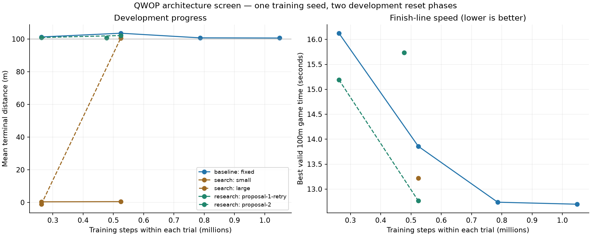

# QWOP architecture campaign 001

A completed exploratory campaign comparing a fixed PPO baseline, a two-candidate predefined MLP search, and two researcher-authored architecture proposals. All approaches had an allowance of 1,048,576 fresh-training interactions with the same PPO settings. One researcher in the current Codex task chose the AI proposals; the Python runner made no model API calls.

## Selected final policies

| Approach | Selected trial | Best 100m game seconds | Mean 100m game seconds | Valid finishes | Parameters |
| --- | --- | ---: | ---: | ---: | ---: |
| baseline | fixed | 12.697 | 12.737 | 6/6 | 50,833 |
| search | large | 13.217 | 13.270 | 6/6 | 167,185 |
| research | proposal-2 | 12.764 | 12.810 | 6/6 | 26,449 |

Historical speed-policy context, rescored from saved trajectories: 13.217 best / 13.250 mean game seconds to 100m, 6/6 valid finishes. Its original training budget is not matched to this campaign; this is a performance reference.

## Interpretation

The selected research design is 0.53% slower than the fixed baseline by best observed 100m time. Its difference versus predefined search and parameter count are saved in `interpretation.json`. These are descriptive results from one training seed, not statistical evidence that AI research beats conventional methods.

Game seconds are raw info.time at the first observed 100m crossing, conditional on native terminal success. Old pilot reports used a different clock scale and native termination time. Video playback follows simulation time, about ten times game seconds.

## Every trial

| Approach / trial | Steps | Parameters | Training minutes | Best development 100m seconds | Development finishes | Mean terminal distance |
| --- | ---: | ---: | ---: | ---: | ---: | ---: |
| baseline/fixed | 1,048,576 | 50,833 | 22.7 | 12.697 | 2/2 | 100.62 m |
| search/small | 524,288 | 17,233 | 11.3 | No finish | 0/2 | 0.50 m |
| search/large | 524,288 | 167,185 | 11.8 | 13.217 | 2/2 | 100.58 m |
| research/proposal-1-retry | 477,184 | 31,569 | 11.8 | 15.737 | 2/2 | 100.63 m |
| research/proposal-2 | 524,288 | 26,449 | 11.4 | 12.764 | 2/2 | 102.14 m |
| research/proposal-1 (transport failure) | 46,253 | 31,569 | 1.7 | Not evaluated | Not evaluated | Not evaluated |

**Protocol amendment:** The first research trial lost its browser response. The failed attempt remains in the archive and budget. An identical architecture restarted from fresh weights for 477,184 steps using only the original slot's remaining allowance. The retry received less effective training; 851 steps remained unused to preserve complete PPO rollouts. The original protocol and the explicit recovery amendment are both archived.

## Research decisions

### proposal-1-retry

Sharing a leg encoder exposes reusable thigh/calf/foot relationships, while torso-relative coordinates make local limb geometry easier to learn than tiny differences between track-scaled absolute x positions. A raw whole-body branch preserves access to every original observation feature. Identical architecture retried after the recorded transport failure.

At 524288 steps, the custom model should finish more often or cross 100m faster than the predefined 64x64 and 256x256 MLP trials. The 262144-step checkpoint will help diagnose learning speed. Lack of progress or collapsed deterministic behavior would argue for simplifying the encoder in the second proposal.

### proposal-2

The first grouped architecture finished both development reset phases at 477184 steps (best 15.7369 game seconds), while the plain 64x64 MLP failed both at 524288 steps. Explicit body geometry may account for useful progress without needing a learned encoder shared by the actor and critic. Preserve all raw observations and add torso-relative positions, velocities, and periodic relative-angle features, then train independent 64x64 policy/value heads.

At 524288 steps, retain two valid development finishes and improve on 15.7369 game seconds. Compare the 262144-step checkpoint to diagnose learning speed, but only the final checkpoint is eligible for selection. Failure rejects this feature/design bundle; it does not isolate whether shared encoding, velocity features, angles, or parameter count caused the difference.

Use a parameter-free 132-feature kinematic representation and 26449 trainable parameters instead of the first design's learned shared encoder and 31569 parameters. This spends the second fixed trial allocation on simplifying the representation after observing successful deterministic behavior in proposal one. No reward, action, observation-source, PPO, seed, evaluation, or budget changes.

## Costs and limitations

Campaign environment steps: **3,184,999**, including 3,144,877 training and 40,122 evaluation/replay steps. Summed training-process duration: 1.18 hours (processes overlapped).

Separate, disclosed engineering smoke test: 43,192 steps.

- One training seed and one campaign per method; no statistical superiority claim
- Custom architectures are unrestricted within the interface and parameter cap; ordinary search explores only two predefined standard MLP widths
- Equal training interactions and evaluation caps, not equal realized compute cost
- Researcher also built the harness and can see baseline results; not blinded
- No algorithm sweep or QR-DQN baseline yet; this isolates architecture within PPO
- Budget is an initial screen, below upstream's recommended full PPO training
- Gait quality is judged from replay, not inferred from speed alone
- Before freezing this protocol, a custom-architecture engineering smoke test used 8192 training steps, 30000 evaluation steps and up to 5000 replay steps; these are disclosed separately and no smoke-test weights are reused

The final six cases mostly repeat two physical reset phases. They are not independent training replications or a held-out robustness test. Any apparent advantage needs fresh-seed replication before a superiority claim.

## Verified replays

- [Baseline versus AI research](C:/Users/zachd/Documents/ChatGPT/QWOP/runs/architecture-001/comparison.mp4)
- [Ordinary search](C:/Users/zachd/Documents/ChatGPT/QWOP/runs/architecture-001/search/replay.mp4)

## Reproducibility

`artifacts.tar.gz` includes proposals, frozen source, policy checkpoints and their architecture source, manifests, budgets and raw evaluation traces. `artifact-index.json` lists their SHA-256 hashes. Proprietary game code, browser files and videos are excluded. Use the repository's locked bootstrap for the game runtime; compatible browser/runtime hashes remain necessary for deterministic replay.

## Gait inspection

All three selected policies still show a knee-scooting gait: low pelvis, one knee repeatedly near the track, and the opposite leg extended forward. The faster benchmark times do not yet deliver convincing upright running.

Qualitative inspection of sampled frames from verified full-trajectory replays. This is not a formal gait classifier, contact-force measurement, or proof about every instant of motion.
