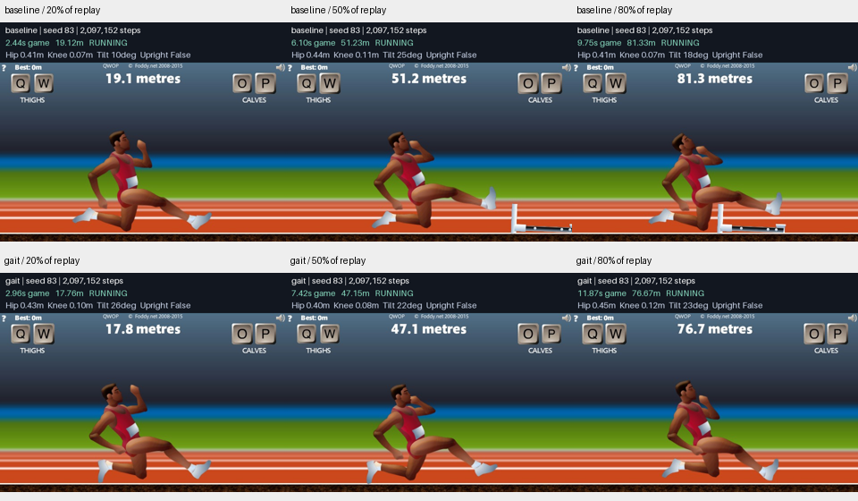

# Gait reward screen

The posture-dependent reward changed the measurements, but did not deliver convincing
upright running. Both final policies finish both reset phases. The treatment takes
**22.38% longer** to reach 100m, while the reviewed samples retain a knee-scooting gait.
Keep this reward experiment unpromoted as an upright-running solution.

Fresh paired seed 83; 2,097,152 steps per arm. Both use the same 128x128 PPO configuration. Only the posture-dependent forward reward differs.

| Final model | Mean 100m game seconds | Mean pelvis height | Knee near ground | Upright forward fraction |
| --- | ---: | ---: | ---: | ---: |
| Native reward | 12.037 | 0.406 m | 98.90% | 0.165% |
| Gait reward | 14.731 | 0.454 m | 63.23% | 1.717% |

The treatment's qualifying forward displacement averages 1.734 m, versus 0.166 m
for the baseline. In the predetermined phase-zero trace, the baseline's qualifying
samples occur only at startup. After startup, the treatment's longest qualifying
streak is four action samples. These are brief posture excursions, not sustained
upright locomotion. This streak analysis is post-hoc and does not select a model.

The baseline's mean 100m time improves from 13.024 seconds at 1,048,576 steps to
12.037 seconds at the final budget, while its knee proximity stays near 99%.
Longer training improved the speed of the existing gait in this seed. The gait
treatment's 524,288-step model stalls near the start, even though its stochastic
training episodes sometimes finish; deterministic evaluation exposes that failure.

| Arm / steps | Finishes | Mean distance | Upright samples | Knee near ground | Upright forward fraction | 100m game seconds |
| --- | ---: | ---: | ---: | ---: | ---: | ---: |
| baseline / 524,288 | 2/2 | 100.84 m | 0.5% | 76.6% | 0.1% | 17.450 |
| baseline / 1,048,576 | 2/2 | 100.74 m | 0.6% | 97.9% | 0.1% | 13.024 |
| baseline / 1,572,864 | 2/2 | 100.80 m | 0.9% | 98.8% | 0.2% | 12.204 |
| baseline / 2,097,152 | 2/2 | 100.92 m | 0.9% | 98.9% | 0.2% | 12.037 |
| gait / 524,288 | 0/2 | 0.43 m | 0.1% | 0.0% | 10.4% | No finish |
| gait / 1,048,576 | 2/2 | 101.62 m | 0.8% | 70.5% | 0.3% | 14.744 |
| gait / 1,572,864 | 2/2 | 100.47 m | 1.5% | 67.2% | 0.6% | 14.017 |
| gait / 2,097,152 | 2/2 | 101.23 m | 3.1% | 63.2% | 1.7% | 14.731 |

The six predetermined images (20%, 50%, and 80% of each fully verified final
phase-zero replay) show low pelvis positions, a folded leg near the track, and
the opposite leg extended forward. The treatment lifts slightly at times but the
reviewed images do not show convincing upright running. See `gait-review.json`.
This visual assessment covers sampled frames, not every instant or contact forces.

Gait percentages are equal-weight means of the two episode summaries. Short failures can have high upright fractions; interpret them alongside distance and completion. Upright forward distance sums positive sampled displacement and is not net progress. These thresholds are exploratory geometric proxies, not a formal running classifier.

One paired training seed and two familiar reset phases. Descriptive reward screen; no statistical superiority, robustness, or convincing running claim without video review. This Mac runtime is distinct from the archived Windows studies.

Training used 4,194,304 steps; evaluation and verified replay used 26,882. All final models are reported.

Separate [engineering diagnostics and smoke tests](../gait-engineering-001/report.md)
used 95,375 steps, including all failed attempts. Total work in this task:
**4,316,561 environment steps**. Training processes took 35.51 and 35.59 minutes
and overlapped. Neither main training run restarted or continued from old weights.

Both final replays verified all 2,026 transitions against normalized observations,
raw body poses, gait measurements, distance, flags, and offset-corrected clocks.
The independent audit recomputed every checkpoint's scores and gait metrics,
confirmed identical initial policy weights, and reconciled the ledgers. All 123
files in the experiment archive and 159 in the engineering archive pass their
SHA-256 checks. Code verification: 42 tests passed, two Windows-specific tests
skipped on macOS; lint, formatting, and dependency checks passed.

The native engine's first speed reward uses its zero-valued reset reaction,
including the initial torso-distance offset. Both arms inherit that convention;
the treatment scales that first term too. Subsequent zero-forward-displacement
transitions receive no additional posture reward.

[Verified comparison video](comparison.mp4). See `audit.json`, `protocol.json`,
`comparison-video.json`, and the archived raw trajectories for reproducibility.
The archive preserves the automatically generated report; this standalone report
adds the subsequent visual interpretation and complete engineering accounting.
