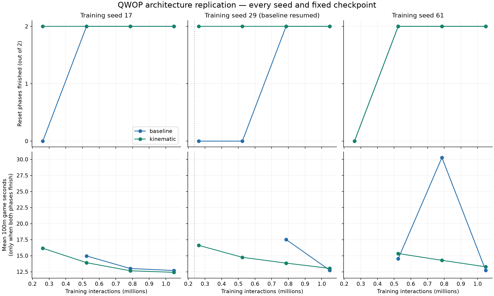
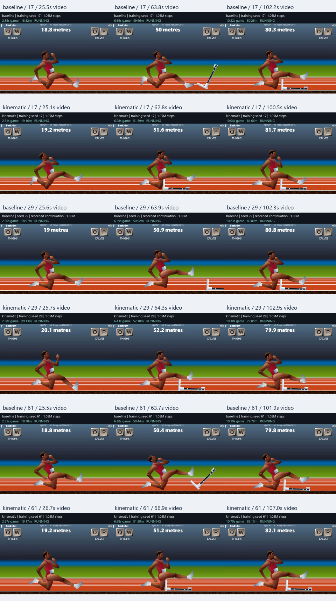
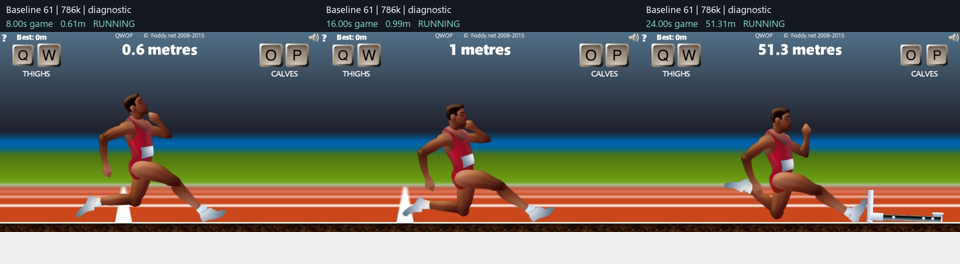

# QWOP architecture replication

Three fresh training seeds per design, with 1,048,576 interactions for every run. Baseline: 128x128 Tanh PPO. Kinematic: the previously selected 64x64 PPO design with fixed torso-relative position, velocity, and periodic angle features. All learning settings, reward, action mapping, game physics, and evaluation rules are shared.

## Every final model

| Training seed | Baseline finishes | Baseline mean seconds | Kinematic finishes | Kinematic mean seconds | Kinematic time change |
| --- | ---: | ---: | ---: | ---: | ---: |
| 17 | 2/2 | 12.697 | 2/2 | 12.417 | -2.20% |
| 29* | 2/2 | 12.731 | 2/2 | 13.031 | +2.36% |
| 61 | 2/2 | 12.737 | 2/2 | 13.277 | +4.24% |

Times use the game's clock at the first observed 100m crossing, conditional on native success. Mean times require both reset phases to finish. Negative percentage changes favor the kinematic design. Every training seed is retained; failures are visible.

- **baseline:** 3/3 training runs finished both phases; 6/6 phase finishes. Mean time among runs finishing both phases: 12.722 seconds. Parameters: 50,833.
- **kinematic:** 3/3 training runs finished both phases; 6/6 phase finishes. Mean time among runs finishing both phases: 12.908 seconds. Parameters: 26,449.

Mean paired time change: **+1.46%** across 3 fully finishing seed pairs. Three seed pairs are a small descriptive sample, not strong statistical evidence.

**Recorded interruption:** baseline training seed 29 resumed from its saved weights and optimizer after a Windows progress-file replacement failed. Its game and action RNG were reset; 2,048 unoptimized rollout interactions remain charged. All models spent the same total interactions, but this one run is not an uninterrupted replication. Its original failure is preserved.

Sensitivity analysis using only uninterrupted seed pairs (17 and 61): 2 fully finishing pairs; mean paired time change 1.017%. Reliability counts and all individual seed results remain in comparison.json.

## Learning curves

Intermediate checkpoints are diagnostic; all final models are evaluated at the same fixed budget. A missing time point means at least one reset phase failed, not zero seconds.

## Movement

All six final policies show knee-scooting in the reviewed replay samples: a low pelvis, one leg folded near the track, and the other extended forward. None of the reviewed samples shows convincing upright running. The fastest final model improves the speed of this gait, rather than introducing a new running gait.

Qualitative visual assessment of predetermined replay samples. No formal gait classifier is used.

### Intermediate startup stall

Baseline seed 61's 786,432-step checkpoint took 16.24 game seconds to reach its first metre in phase zero, then crossed 100m at 30.26 seconds. Verified diagnostic frames show an initial near-stationary lunge followed by knee-scooting. This explains the large slowdown in its learning curve. The checkpoint remains diagnostic and is not substituted for its final model.

These post-hoc diagnostic prefixes used 2,100 additional replay interactions within the existing evaluation cap; they are included in the total cost.

## Verified videos

- [Baseline versus kinematic, training seed 17](C:/Users/zachd/Documents/ChatGPT/QWOP/runs/replication-002/comparison-seed-17.mp4)
- [Baseline versus kinematic, training seed 29](C:/Users/zachd/Documents/ChatGPT/QWOP/runs/replication-002/comparison-seed-29.mp4)
- [Baseline versus kinematic, training seed 61](C:/Users/zachd/Documents/ChatGPT/QWOP/runs/replication-002/comparison-seed-61.mp4)

## Limits and interpretation

This tests a previously selected architecture across new training randomness. It does not repeat the AI proposal process, compare AI versus ordinary search, or establish architectural novelty. The kinematic design combines a different feature representation with smaller policy/value heads; these effects are not isolated. All policies use PPO; QR-DQN has not been tested here.

There are three independent training runs per design. The two evaluation reset phases have very limited physical diversity and are not a held-out robustness suite. Extra episode labels would not create extra independent training evidence. Faster knee-scooting would not establish convincing running.

## Costs and startup recovery

Training: **6,291,456 interactions**. Evaluation and replay: **80,999**. Total experiment: **6,372,455**. Summed training-process duration: 2.46 hours; processes overlapped, so this is not elapsed wall time or CPU-seconds. Separate startup diagnostics appear in costs.json.
The preceding zero-step startup failures additionally consumed 6.36 summed process minutes.

The preceding launch batch failed all six starts before taking any game steps. Its artifacts and zero-step ledgers are preserved and hash-linked by this protocol. Clearing orphaned headless browsers restored startup. Browser cleanup and registration timeout handling were adjusted before freezing this replacement batch. The six planned training allowances were not expanded. The Python runner made no model API calls; Codex usage is not instrumented here.

## Reproducibility

The audit recomputes scores from all saved trajectories, checks model and trace hashes, verifies configuration and step budgets, confirms distinct initial weights across training seeds, and verifies the six final videos. The archive contains frozen source, models, evaluations, ledgers, and preserved failed-start artifacts. The proprietary game and browser are excluded; compatible bootstrapped runtime files are required.
